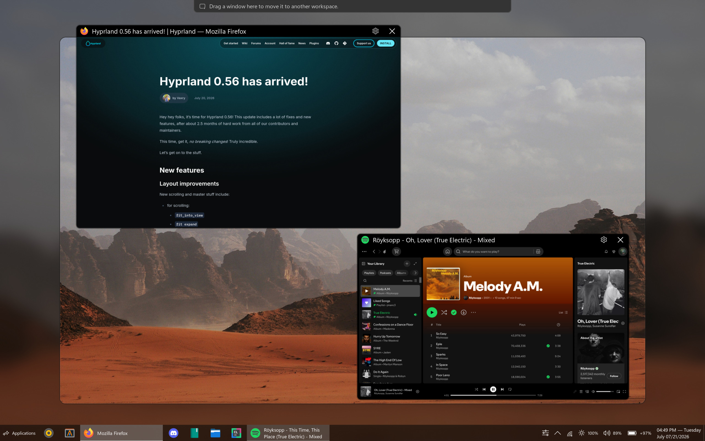

# Mylarplugin

Mylarplugin implements Mylardesktop on Hyprland



## Features

- Animated snap preview
  - Snap groups
  - Snap groups in alt tab menu 
- Physics based spring animations everywhere, like we're living in the 21st century
- Integrated dock
  - wifi control with NetworkManager, or wpa_supplicant
  - audio control with pulseaudio, or alsa
  - bluetooth when bluetoothd running
  - minimize animations
  - brightness control with brightnessctl
  - sleep cpu windows and wake them up for games
  - pin windows to above or below
- Overview mode of windows
- Top workspace preview mover
- Rofi like quick launcher, for applications, or to send text to other programs and accelarete your workflow
- Alt kakoune menu to accelarete your workflow
- Desktop folders
  - Animated selection
- Nightlight
- Mica effect
- Wallpaper engine
- Screenshot tool
  - Edit with, features that sorts most recently used
- Seamless transition into tiling mode (powered by Hyprland)
- Alt tab menu
- Hints for shortcuts
- Screen lock
- Pixel perfect zoom

## Installation

You can install Mylar wherever there is a stable Hyprland package for your system.

```bash
yay -S mylardesktop
```

Or, if you already have Hyprand, you can install it as a [plugin]() instead.

In your login manager you should now see an option `Mylardesktop via USWM`. Select that and login.

## Manually building plugin

First install build dependencies

```
sudo pacman -S git gcc cmake make pkg-config pango cairo librsvg libxkbcommon dbus
```

Download the latest Mylardesktop release 0.2.1 (for Hyprland 0.51.0) and unzip it (or untar it), and enter the folder.

```
cd Mylardesktop
make release
```

That will generate `mylar-desktop.so` inside of the `out` folder.

Now you can load the plugin on Hyprland by running `hyprctl plugin load /full/path/to/mylar-desktop.so`. To automatically run the plugin when Hyprland starts, Modify `~/.config/hypr/hyprland.conf`, and add `exec-once = hyprland plugin load /full/path/to/mylar-desktop.so` somewhere.

## Information for packagers

https://github.com/*

